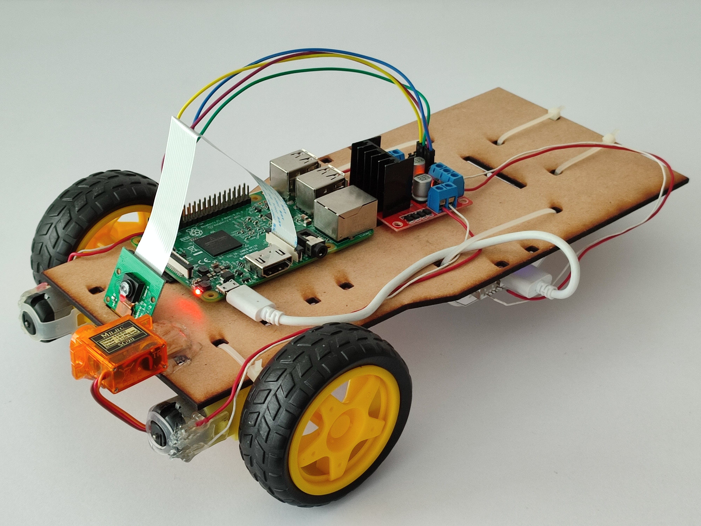
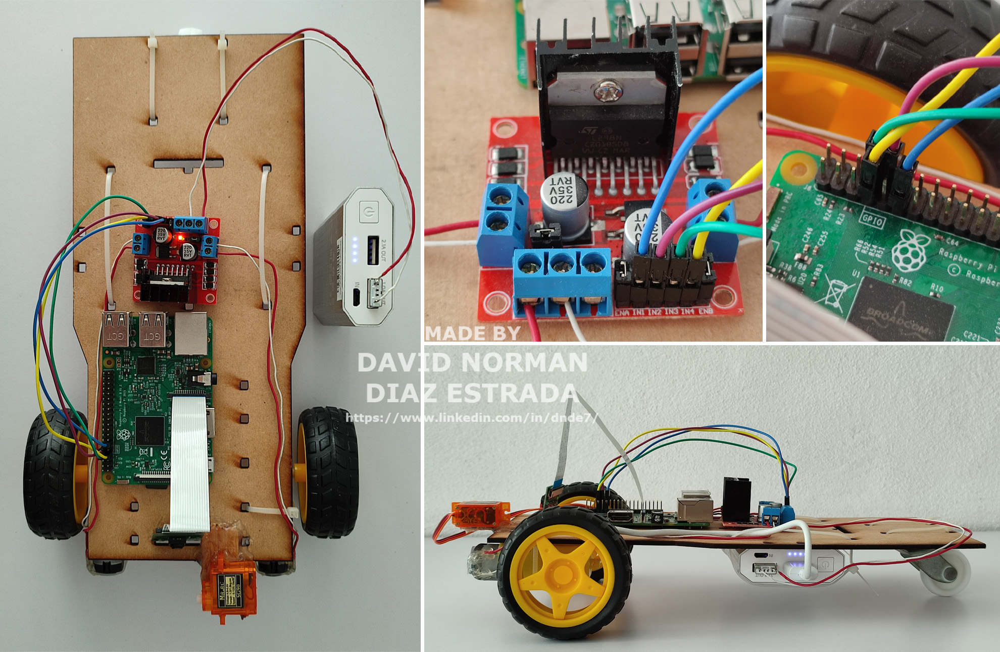
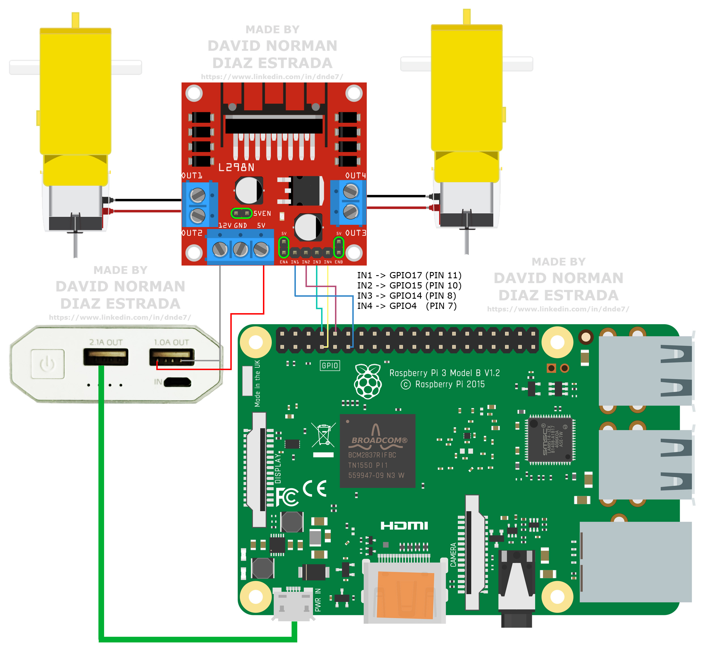

<div align="center">
  <h1>Autopy</h1>
  
  <h4>
    A remote-controlled vehicle made with a Raspberry Pi 3 Model B and  a camera module<br>
    Made by David Norman Díaz Estrada<br>
    https://www.linkedin.com/in/dnde7/
  </h4>
  
  ---
  
  <picture>
    
  </picture>
  
</div>


------------------
**Environment Installation:**<br/>
------------------

Autopy requires the following:
tkinter==8.6 , customtkinter==5.2.0 , darkdetect==0.8.0 , picamera==1.13 , Pillow==10.0.0 , RPi.GPIO==0.7.1

You can do the installation as follows:

Clone this repo:
```
git clone https://github.com/DavidDZ7/autopy.git
```
Create a virtual environment inside the project folder:
```
python3 -m venv virtualEnv
```

Activate the environment:
```
source virtualEnv/bin/activate
```

Install tkinter on Raspberry (Linux):
```
sudo apt-get install python3-tk
```

Install other libraries:

```
pip3 install customtkinter
pip install RPi.GPIO
pip install picamera
pip install pillow
```

------------------
**Run Autopy**<br/>
------------------

Once your environment is ready you can launch Autopy as follows:

Navigate to the project folder, for example:
```
cd /home/david/Desktop/autopy/
```
Activate your virtual environment:
```
source virtualEnv/bin/activate
```
Run the main script:
```
python autopyMain.py
```


------------------
**Hardware setup**<br/>
------------------

  <picture>
    
  </picture>

  <picture>
    
  </picture>

