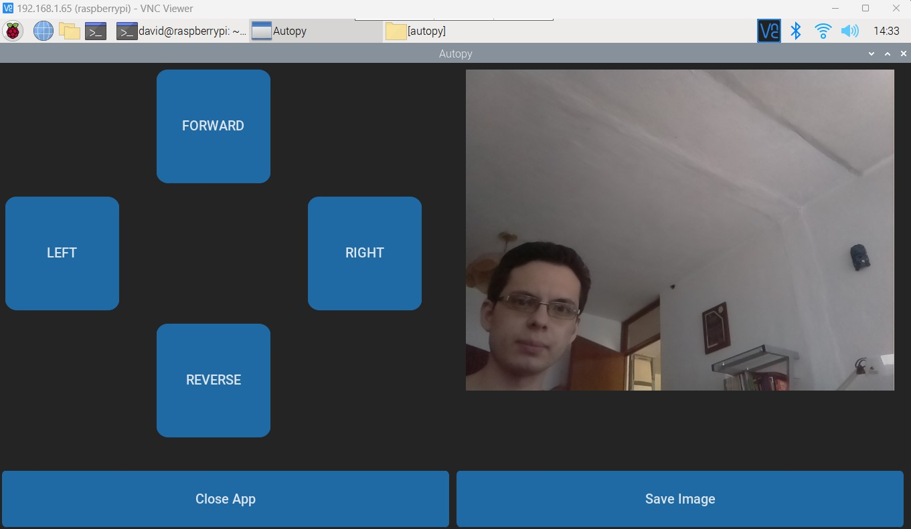

<div align="center">
  <h1>Autopy</h1>
  
  <h4>
    A remote-controlled vehicle made with a Raspberry Pi 3 Model B and  a camera module<br>
    Made by David Norman Díaz Estrada<br>
    https://www.linkedin.com/in/dnde7/
  </h4>
  
  ---
  
  <picture>
        
  </picture>
  <picture>
        
  </picture>

The Autopy GUI allows the user to control the vehicle via wifi from either a PC or smartphone by using VNC viewer.<br>
The GUI also streams the frontal camera of the vehicle and allows the user to take photos with the "Save Image" button.
  
</div>


------------------
**Hardware setup**<br/>
------------------

List of parts:
<ul>
  <li>Raspberry Pi 3 model B.</li>  
  <li>Raspberry Pi Cam rev 1.3 (5MP).</li>
  <li>Dual H-Bridge Motor Driver L298N.</li>
  <li>Power bank 10050mAh (model Adata a10050).</li>  
  <li>USB type A adapter with pinout (VCC and GND).</li>
  <li>[2x] Arduino DC motor (3-6 VDC).</li>
  <li>[4x] Female to female jumper wires.</li>
</ul>


  <picture>
    
  </picture>
  
  <picture>
    
  </picture>


The power bank is used for both the Raspberry and the motor driver module L298N.
This particular power bank has 2 USB outputs, the 2.1 Amperes output is used to power the Raspberry and the 1 Ampere output powers the L298N module.
To connect the power bank with the L298N module I used a USB type A adapter with a pinout and welded 2 cables (VCC and GND).

In the pictures, there is a servo motor attached to the vehicle's chassis but it is not part of the circuit (I used it for a previous project).


------------------
**Environment Installation:**<br/>
------------------

Autopy requires the following:
tkinter==8.6 , customtkinter==5.2.0 , darkdetect==0.8.0 , picamera==1.13 , Pillow==10.0.0 , RPi.GPIO==0.7.1

You can do the installation as follows:

Clone this repo:
```
git clone https://github.com/DavidDZ7/autopy.git
```
Create a virtual environment inside the project folder:
```
python3 -m venv virtualEnv
```

Activate the environment:
```
source virtualEnv/bin/activate
```

Install tkinter on Raspberry (Linux):
```
sudo apt-get install python3-tk
```

Install other libraries:

```
pip3 install customtkinter
pip install RPi.GPIO
pip install picamera
pip install pillow
```

------------------
**Run Autopy**<br/>
------------------

Once your environment is ready you can launch Autopy as follows:

Navigate to the project folder, for example:
```
cd /home/david/Desktop/autopy/
```
Activate your virtual environment:
```
source virtualEnv/bin/activate
```
Run the main script:
```
python autopyMain.py
```

